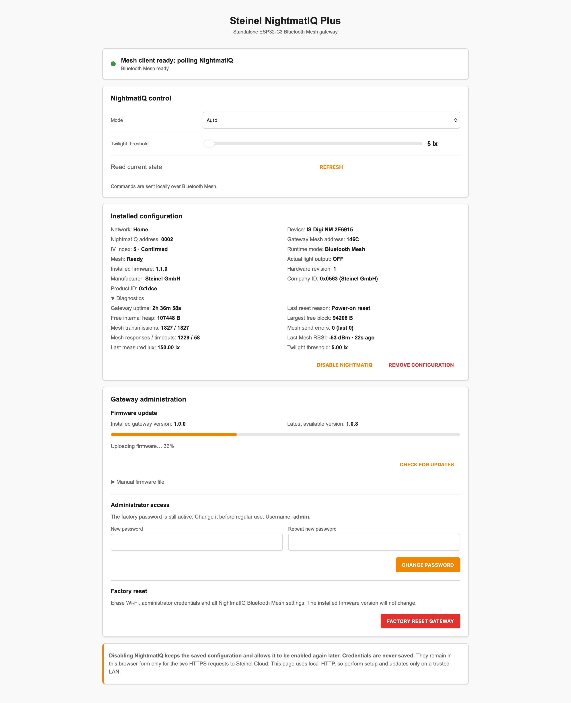

# Steinel NightmatIQ Plus Gateway for ESP32-C3

> **Standalone ESP32-C3 Bluetooth Mesh gateway for local Steinel NightmatIQ Plus control, diagnostics, firmware updates, and Home Assistant integration.**

```text
Steinel NightmatIQ Plus <-> Bluetooth Mesh <-> ESP32-C3 gateway -> Home Assistant
```

Community ESPHome firmware that turns an ESP32-C3 Super Mini into a dedicated local Steinel NightmatIQ Plus gateway. It imports the existing Steinel network configuration, communicates directly over Bluetooth Mesh, provides a password-protected browser interface, and exposes control, sensor, identity, and diagnostic entities to Home Assistant.

Author and maintainer: **Bartosz Supcziński** — <bartek@env.pl>

> **A big thank you to [Bartosz Supcziński](https://github.com/supczinskib).** This project is a fork of his [steinel-nightmatiq-esp32-c3-gateway](https://github.com/supczinskib/steinel-nightmatiq-esp32-c3-gateway) and would not exist without it. The Bluetooth Mesh client, the address and session handling, the ESPHome component, the local web interface and the firmware update flow are all his work; this fork builds on that foundation to control every device of a Steinel Mesh network, not only the NightmatIQ Plus. Thank you for creating it and for releasing it as open source under the GPL-3.0.

## Why this project exists

NightmatIQ Plus communicates through Bluetooth Mesh, while Home Assistant uses an IP network. The ESP32-C3 bridges these two environments: it joins the existing Mesh installation, exchanges commands and status messages directly with the sensor, and publishes them through ESPHome. The network configuration is imported once from a local backup file; no Steinel account or cloud access is needed, and routine operation is local.

## Screenshots

### ESP32-C3 Super Mini


### Local web interface

The built-in page provides setup, control, diagnostics and browser-based firmware updates.



### Home Assistant device

The standard ESPHome integration exposes NightmatIQ directly as a single Home Assistant device.


## What this project provides

### Local Bluetooth Mesh integration

- Imports a Steinel network backup (.json) from a local file, without a Steinel account.
- Restores the network key, application key, IV Index and NightmatIQ node information.
- Communicates directly with the NightmatIQ over Bluetooth Mesh.
- Reads actual output state, illuminance, twilight threshold, firmware version, hardware revision and product identity.
- Controls `Auto`, `Always On` and `Always Off` operating modes.
- Changes the twilight threshold from `1` to `1500 lx`.

### All devices of the network

- Stores every controllable node from the backup, not only the NightmatIQ Plus.
- Reads on/off state, brightness, automatic mode, motion and illuminance of each device.
- Controls lamps: on/off, brightness and automatic (sensor controlled) mode.
- Local API: `GET /api/nodes` and `POST /api/nodes/<address>?on=1&brightness=40&auto=0&threshold=25`.
- Home Assistant integration for all devices, maintained in a separate repository: [HomeAssistant-Steinel-Mesh](https://github.com/CFenner/HomeAssistant-Steinel-Mesh).

### Reliable address and session handling

- Selects a gateway Mesh address from the unoccupied part of the provisioner range.
- Recovers automatically when Mesh peers reject a reused source address.
- Persists the first confirmed source address, preventing unnecessary changes after later restarts or temporary sensor outages.
- Preserves Mesh settings across normal reboots and OTA updates.
- Uses bounded retries and controlled restarts around Bluetooth transitions.

### Device web interface

- Network setup by importing a backup file, with a card for every device.
- Live control and state refresh.
- Installed configuration and extended diagnostics.
- Mesh RSSI and response counters.
- Password-protected browser OTA update.
- Administration panel with firmware updates, administrator password management and a complete factory reset.

### Home Assistant integration

The standard ESPHome API publishes:

- Bluetooth Mesh readiness and status;
- signal strength;
- gateway diagnostics: uptime, last reset reason, free heap, largest free block and the Bluetooth Mesh traffic counters (transmissions, send errors, last send error, responses, timeouts);
- a manual refresh action.

The primary device's light entities (actual light output, illuminance, operating mode and twilight threshold) are hidden from Home Assistant by default, because the Home Assistant integration [HomeAssistant-Steinel-Mesh](https://github.com/CFenner/HomeAssistant-Steinel-Mesh) controls every device, including that one. While they are hidden, the gateway also skips its old NightmatIQ-only polling: the primary device is polled by the same engine as every other device. To publish them again (which also restores that polling), set `main_light_internal: "false"` in the substitutions of `esphome/steinel-c3.yaml` and rebuild.

Home Assistant displays all published entities under one device named **Steinel Mesh Gateway**.

## Hardware and compatibility

### Required hardware

- ESP32-C3 Super Mini with 4 MB flash;
- native USB/JTAG serial connection for the first installation or recovery;
- 2.4 GHz Wi-Fi network;
- Backup file (.json) of your Steinel Bluetooth Mesh network, obtained from the Steinel Connect app.

The USB interface normally appears as an Espressif USB JTAG/serial device (`303a:1001`) and as `/dev/ttyACM*` on Linux.

### Supported target

The firmware is designed for the ESP32-C3 and ESP-IDF. Bluetooth 5 extended features are disabled because Bluetooth Mesh uses the BLE 4.2 advertising path. The configuration is intentionally sized for the limited RAM of the ESP32-C3.

## Security

- The factory administrator account is `admin` with password `12345678`; change it on the device page immediately after joining Wi-Fi.
- The administrator password protects both the local page and firmware updates and is stored in ESP32 NVS.
- The provisioning access point uses the factory password `12345678`.
- Steinel credentials entered on the setup page are used for the required HTTPS requests and are never saved by the gateway.
- The local web interface uses HTTP Digest authentication. It authenticates access but does not encrypt local HTTP traffic.
- The default ESPHome native API configuration does not use an encryption key.
- Perform setup and firmware updates only on a trusted LAN or an isolated IoT network.
- Do not commit a real `secrets.yaml`, private keys, packet captures or Steinel backups.

## Repository layout

| Path | Purpose |
|---|---|
| `esphome/steinel-c3.yaml` | Main ESPHome firmware configuration |
| `esphome/components/steinel_mesh/` | Bluetooth Mesh, multi-device engine and local web component |
| `scripts/` | Installation, validation, USB and OTA helpers |
| `docs/images/` | Public README images |

## Ready-made installation

The recommended first installation does not require compiling ESPHome:

1. Download the latest `steinel-nightmatiq-esp32-c3-gateway-vX.Y.Z-factory.bin` from [GitHub Releases](https://github.com/CFenner/steinel-mesh-esphome-gateway/releases/latest).
2. Open [ESPHome Web](https://web.esphome.io/) in a WebSerial-capable browser and connect the ESP32-C3 by USB.
3. Select the board, choose **Install**, and select the downloaded `-factory.bin` file.
4. After installation, continue with **Connect Wi-Fi** and **Connect NightmatIQ** below.

The file is processed locally by ESPHome Web. The `-factory.bin` image is for a new board or USB recovery; later browser updates use the `-ota.bin` image.

## Building from source

## Requirements

- Linux or macOS host;
- Python 3 and a supported ESPHome environment;
- USB access for the first installation;
- network access to the ESP32-C3 during initial setup;
- Home Assistant is optional.

The supplied installer creates an isolated, reproducible environment using unmodified ESPHome `2026.7.3`. No patch is applied to the installed ESPHome package.

## 1. Download and prepare the project

Clone or download this repository, enter its directory and install the pinned toolchain:

```bash
sudo bash scripts/01_install_esphome.sh
```

## 2. Validate

```bash
bash scripts/03_validate_all.sh
```

This runs repository checks and validates the ESPHome configuration.

## 3. First installation or USB recovery

Connect the ESP32-C3 and use its stable `/dev/serial/by-id/` path when available:

```bash
sudo bash scripts/09_upload_usb.sh /dev/serial/by-id/usb-Espressif_USB_JTAG_serial_debug_unit_*-if00
```

If the board has no `by-id` link, use the detected ACM port:

```bash
sudo bash scripts/09_upload_usb.sh /dev/ttyACM0
```

The same compiled image can be installed on every supported ESP32-C3 board. The first USB installation also prepares the device for subsequent browser updates, so the boot button is normally not required again.

## 4. Connect Wi-Fi

1. Connect to the access point named `steinel-mesh-gateway` using password `12345678`.
2. Select the target 2.4 GHz Wi-Fi network in the captive portal and enter its password.
3. Wait for the gateway to restart and connect to the selected network.
4. Open the address assigned by the router or the device hostname ending in `.local`.

The Wi-Fi configuration is stored by the device and survives firmware updates.

## 5. Connect NightmatIQ

1. Open the gateway address in a browser.
2. Sign in as `admin` with factory password `12345678`.
3. In **Administration**, change the password in the visible **Administrator access** section. The same new password will authorize future firmware updates.
4. Sign in again after the automatic restart.
5. Under **Set up your network**, choose the backup file (.json) of your Steinel network (obtained from the Steinel Connect app) and select **Import backup file**.
6. Allow the gateway to restart. Every device found in the backup then appears under **Devices**.

The NightmatIQ node address and IV Index are selected automatically from the backup. The file contains your Mesh keys: keep it private and never commit it to a repository.

## 6. Updating over Wi-Fi

The gateway checks the latest stable GitHub release when its page opens; **CHECK FOR UPDATES** repeats the check manually. If a newer version is available, **DOWNLOAD AND INSTALL** downloads it over HTTPS, verifies its size and SHA-256 digest, installs it and restarts the gateway. A failed update leaves the current firmware active.

Manual installation remains available under **Manual firmware file**. Use only the release file ending in `-ota.bin`; `-factory.bin` is intended exclusively for the first USB installation. No separate OTA password is used or shown to the user.

**Factory reset** removes Wi-Fi, administrator and NightmatIQ Mesh settings, then restores the factory account and configuration access point without changing the installed firmware version.

From the command line, enter the administrator password when requested:

```bash
bash scripts/05_upload_ota.sh DEVICE_IP_OR_HOSTNAME
```

## 7. Home Assistant integration

Home Assistant usually discovers the device automatically through ESPHome. If it does not:

1. Open **Settings → Devices & services**.
2. Add the **ESPHome** integration.
3. Enter the gateway IP address or hostname.
4. Assign **Steinel Mesh Gateway** to the required area.

All control and diagnostic entities are attached directly to that device.

## Multiple gateways

During network import, each gateway derives a Mesh address policy from the selected installation and its own hardware identity. The same firmware can therefore be configured for different ESP32-C3 boards and NightmatIQ installations.

The device name has no MAC suffix, so every gateway uses the hostname and access-point name `steinel-mesh-gateway`. When you run more than one gateway on the same network, give each its own `name` in the substitutions of `esphome/steinel-c3.yaml` before building (or add `name_add_mac_suffix: true` under `esphome:` to derive a unique name from the MAC address). Configure a unique administrator password on each gateway.

## Fallback access point

If the configured Wi-Fi network is unavailable for 60 seconds, the gateway starts its password-protected access point again. Connect using factory access-point password `12345678` and update the Wi-Fi configuration through the captive portal. The local page remains protected by the administrator password selected on the device.

## Troubleshooting

### The gateway does not appear in Home Assistant

- Check that Home Assistant can reach the gateway on the IoT network.
- Add the ESPHome integration manually by IP address if discovery is filtered between VLANs.
- Confirm that the gateway is online and restart the ESPHome integration if the connection remains unavailable.

### Mesh is ready but values remain unavailable

- Move the ESP32-C3 closer to the NightmatIQ and check **Last Mesh RSSI** in diagnostics.
- Wait for IV Index synchronization after importing a network backup.
- Use **Refresh** to request the current state.

### Backup import fails

- Confirm that the file is a Bluetooth Mesh backup in `.json` format that contains your network and application keys and the device keys.
- Remove an existing configuration first; an import is only accepted while no network is installed.
- The file must fit into the inactive firmware partition (below about 1.7 MB).
- Obtain the backup from the Steinel Connect app again if the file looks incomplete.
- Read the error shown at the top of the page, then try again.

### OTA update fails

- Confirm the target address and gateway administrator password.
- Use the browser updater from a trusted LAN.
- Recover through native USB if the device no longer reaches Wi-Fi.

## Related project

The same Steinel NightmatIQ Plus functionality is also available as an optional integration in the [AR01V3 RF/IR, ESP-RC01 & Steinel NightmatIQ Plus Gateway](https://github.com/supczinskib/athom-ar01v3-esp-rc01-gateway). Choose that project when NightmatIQ should be added to an existing multifunction AR01V3 gateway; choose this repository for a small, dedicated ESP32-C3 installation.

## License

Copyright (C) 2026 Bartosz Supcziński.

This project is licensed under the GNU General Public License version 3 only (`GPL-3.0-only`). See [LICENSE](LICENSE).

## Credits and support

- Author and maintainer: **Bartosz Supcziński**, <bartek@env.pl>.
- ESPHome project identifier: `cfenner.steinel_mesh_gateway`.

When reporting a problem, include the firmware version, ESPHome version, reset reason and relevant logs. Remove passwords, keys, authorization headers, private backups and network identifiers before sharing diagnostics.

This is an independent community project and is not an official Steinel, ESPHome, or Home Assistant product.
